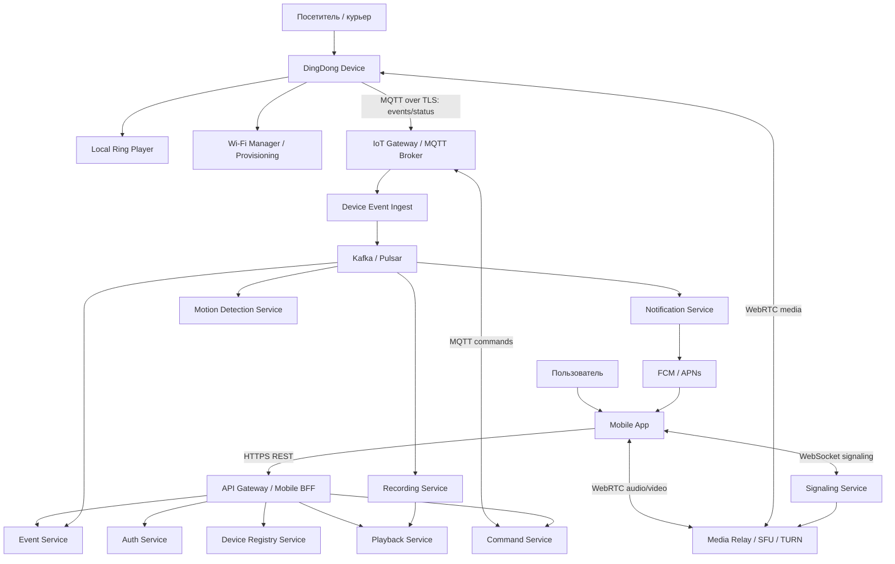
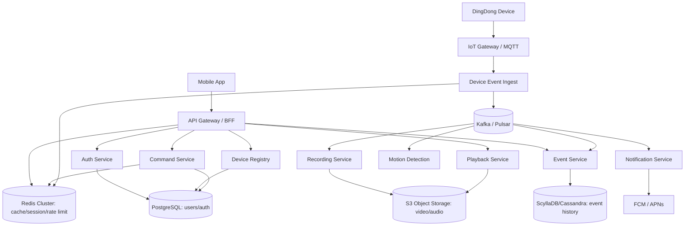
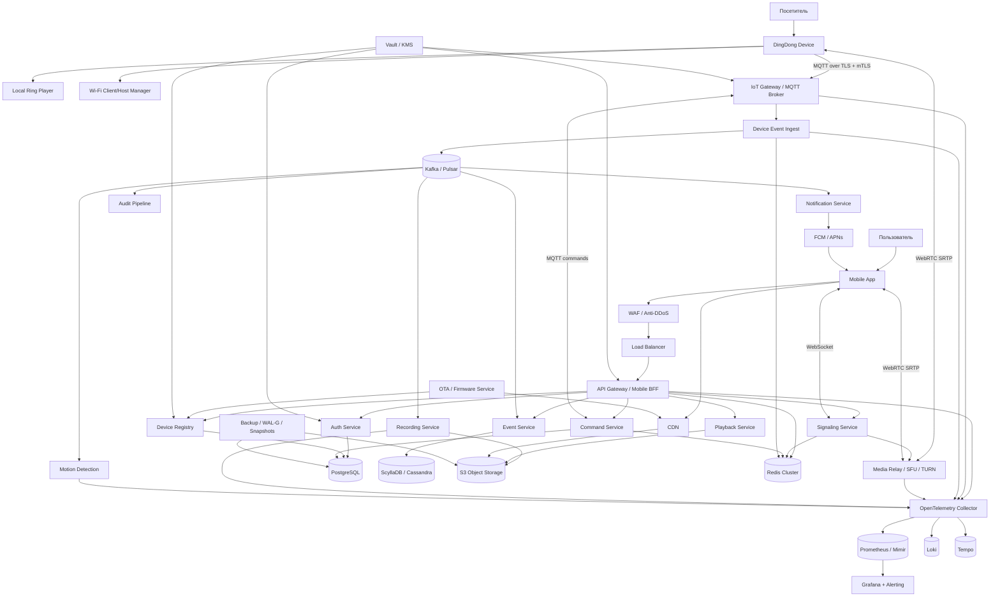

# HW_2_SOLUTION: High Level Design DingDong

---
## Содержание

- [[#1. Исходные требования из HW1|1. Исходные требования из HW1]]
    - [[#1.1 Функциональные требования|1.1 Функциональные требования]]
    - [[#1.2 Нефункциональные требования и масштаб|1.2 Нефункциональные требования и масштаб]]
- [[#2. Part 1. Декомпозиция и интеграции|2. Part 1. Декомпозиция и интеграции]]
    - [[#2.1 Подход к декомпозиции|2.1 Подход к декомпозиции]]
    - [[#2.2 Домены и основные сущности|2.2 Домены и основные сущности]]
    - [[#2.3 Модули устройства|2.3 Модули устройства]]
    - [[#2.4 Backend-сервисы|2.4 Backend-сервисы]]
    - [[#2.5 Способы взаимодействия|2.5 Способы взаимодействия]]
    - [[#2.6 HLD-схема Part 1|2.6 HLD-схема Part 1]]
- [[#3. Part 2. Выбор баз данных|3. Part 2. Выбор баз данных]]
    - [[#3.1 Алгоритм выбора БД|3.1 Алгоритм выбора БД]]
    - [[#3.2 БД под сценарии|3.2 БД под сценарии]]
    - [[#3.3 Репликация и шардинг|3.3 Репликация и шардинг]]
    - [[#3.4 HLD-схема с БД|3.4 HLD-схема с БД]]
- [[#4. Part 3. Дополнительные компоненты HLD|4. Part 3. Дополнительные компоненты HLD]]
    - [[#4.1 MUST-компоненты|4.1 MUST-компоненты]]
    - [[#4.2 SHOULD-компоненты|4.2 SHOULD-компоненты]]
    - [[#4.3 Итоговая HLD-схема|4.3 Итоговая HLD-схема]]
- [[#5. Ключевые архитектурные решения|5. Ключевые архитектурные решения]]
- [[#6. Источники из HW1|6. Источники из HW1]]

---
# 1. Исходные требования из HW1

Система: **DingDong** — Wi-Fi дверной звонок с камерой, мобильным приложением и backend-сервисами.

Главная идея архитектуры: локальная функция звонка должна работать даже без облака, а тяжелые сценарии — push, live video/audio, motion detection и запись — выносятся в backend.

## 1.1 Функциональные требования

| ID | Требование | Приоритет | Архитектурное следствие |
|---:|---|---:|---|
| FR-1 | Устройство проигрывает громкий ring sound при нажатии кнопки | P0 | Локальный модуль ring player на устройстве, без зависимости от backend |
| FR-2 | Устройство поднимает временный открытый Wi-Fi host для первичной настройки | P0 | Нужен provisioning mode на устройстве |
| FR-3 | Приложение передает SSID/пароль домашнего Wi-Fi и admin password устройства | P0 | Нужен безопасный bootstrap-сценарий и регистрация устройства |
| FR-4 | Устройство подключается к домашнему Wi-Fi как client | P0 | Нужен Wi-Fi manager и хранение credentials на устройстве |
| FR-5 | При нажатии кнопки устройство отправляет событие в backend | P0 | Нужен device event ingest |
| FR-6 | Backend отправляет push на телефон владельца | P0 | Нужен notification service и интеграция с FCM/APNs |
| FR-7 | После подтверждения пользователем начинается two-way audio | P0 | Нужен low-latency media path, не REST |
| FR-8 | После подтверждения пользователем начинается video stream | P0 | Нужен media relay / SFU / TURN |
| FR-9 | Пользователь может поменять пароль устройства через существующее Wi-Fi соединение | P1 | Нужен command channel до устройства |
| FR-10 | Устройство/сервис детектит движение и отправляет push | P1 | Нужен motion detection pipeline |
| FR-11 | После подтверждения motion event запускается audio/video stream | P1 | Motion event должен уметь создавать live session |
| FR-12 | При motion event сервис сохраняет video/audio запись | P1 | Нужен recording service и object storage |
| FR-13 | Пользователь может включить громкую сирену | P2 | Нужен защищенный command service |

## 1.2 Нефункциональные требования и масштаб

| Метрика | Значение из HW1 | Что значит для HLD |
|---|---:|---|
| Расчетная база устройств | **25.327 млн устройств** | Нужна горизонтальная масштабируемость device-facing сервисов |
| Обычная активность | **329.25–405.23 млн событий/сутки** | Event pipeline должен быть append-only и асинхронным |
| Высокая активность | **633.18–759.81 млн событий/сутки** | Нельзя писать все в одну реляционную БД |
| Средняя event-нагрузка | **3 811–8 794 событий/с** | Нужны broker, partitioning и backpressure |
| Битрейт одного stream | **2 Mbps/device** | Медиа нужно отделить от обычного backend API |
| Запись одного события 120 секунд | **≈30 МБ/событие** | Видео хранить в object storage, не в SQL |
| Суточный объем event video | **9.88–22.79 ПБ/сутки** | Нужны lifecycle policies, TTL и платные тарифы хранения |
| Push payload | До **4096 bytes** | Push должен содержать только короткий event id, не данные видео |
| 24/7 запись | **не входит в MVP** | Иначе получается экстремально дорогой трафик и storage |

---
# 2. Part 1. Декомпозиция и интеграции

## 2.1 Подход к декомпозиции

Используем DDD на верхнем уровне. Система естественно делится на несколько bounded context:

| Bounded context | За что отвечает | Почему отдельно |
|---|---|---|
| Identity & Access | Пользователи, сессии, права, привязка app/device | Нужна строгая безопасность доступа к видео и командам |
| Device Management | Регистрация устройств, ownership, credentials, firmware state | Устройства живут дольше пользовательских сессий и имеют отдельный lifecycle |
| Event Processing | Button press, motion event, event history | Поток событий большой, append-only, хорошо масштабируется отдельно |
| Notification | Push в мобильное приложение | Отдельные retries, rate limit, интеграция с внешними FCM/APNs |
| Media | Live video/audio, signaling, relay, TURN/SFU | Медиа имеет другие требования: latency, bandwidth, UDP/WebRTC |
| Recording | Запись и хранение event video/audio | Огромный storage, lifecycle, асинхронная обработка |
| Motion Detection | Анализ видеопотока и генерация motion events | CPU/GPU-нагрузка, может масштабироваться независимо |
| Command & Control | Команды на устройство: siren, password change, start stream | Требуется авторизация, idempotency и доставка до online-device |

Главное решение: **не делать монолитный backend для всего**. События, медиа, запись и уведомления имеют разные профили нагрузки, поэтому их нужно разделить.

## 2.2 Домены и основные сущности

| Домен | Основные сущности |
|---|---|
| User / Account | User, MobileSession, DeviceOwner, Permission |
| Device | Device, DeviceToken, FirmwareVersion, WiFiState, ProvisioningSession |
| Event | DoorbellEvent, MotionEvent, EventStatus, EventTimeline |
| Notification | PushToken, PushMessage, DeliveryAttempt |
| Media | LiveSession, MediaPeer, WebRTCSession, StreamState |
| Recording | Recording, RecordingSegment, StorageObject, RetentionPolicy |
| Command | DeviceCommand, CommandStatus, CommandAudit |

## 2.3 Модули устройства

| Модуль устройства | Ответственность |
|---|---|
| Button interrupt handler | Обработка нажатия основной кнопки |
| Ring player | Проигрывание ring sound из ROM |
| Wi-Fi manager | Переключение между Wi-Fi client и temporary Wi-Fi host |
| Provisioning module | Первичная настройка через мобильное приложение |
| Credentials storage | Локальное защищенное хранение Wi-Fi/admin/device credentials |
| Device event client | Отправка button/motion/status events в backend |
| Media capture | Работа с камерой, микрофоном, speaker |
| Media streaming client | Запуск WebRTC/streaming session после подтверждения клиента |
| Command listener | Получение команд: start stream, siren, password change |
| Health reporter | Heartbeat, battery/network/firmware status |

## 2.4 Backend-сервисы

| Сервис | Назначение | Тип нагрузки |
|---|---|---|
| API Gateway / Mobile BFF | Единая точка входа для мобильного приложения | HTTP, user-facing |
| Auth Service | Login, token validation, user sessions | Read-heavy, strict security |
| Device Registry Service | Регистрация устройств, ownership, device metadata | Read/write, strong consistency |
| Provisioning Service | Привязка устройства к аккаунту и выдача bootstrap-token | Write-heavy при setup |
| Device Event Ingest Service | Прием button/motion/status events от устройств | Very write-heavy |
| Event Service | Хранение и отдача event history | Write-heavy + reads by user/device/time |
| Notification Service | Push через FCM/APNs | Async, retries |
| Signaling Service | Создание live audio/video sessions | Low latency control plane |
| Media Relay / SFU / TURN | Передача live video/audio между device и app | High bandwidth, low latency |
| Motion Detection Service | Анализ видео и генерация motion events | CPU/GPU-heavy |
| Recording Service | Запись event video/audio в object storage | High bandwidth + async jobs |
| Playback Service | Выдача записей через signed URLs | Read-heavy по видеоархиву |
| Command Service | Команды на устройство: siren/password/start stream | Security-critical |
| Firmware/OTA Service | Обновления firmware и rollout | Batch + CDN |

## 2.5 Способы взаимодействия

| Интеграция | Способ | Обоснование |
|---|---|---|
| Mobile App → API Gateway | HTTPS REST | Простые user-facing операции: профиль, устройства, история, настройки |
| Mobile App ↔ Signaling Service | WebSocket | Нужно держать состояние live-session и быстро обмениваться signaling messages |
| Mobile App ↔ Media Relay | WebRTC | Для audio/video нужен low-latency media path; REST для этого не подходит |
| Device → Device Event Ingest | MQTT over TLS | Для IoT лучше REST: легкий протокол, долгоживущие соединения, QoS, reconnect |
| Backend → Device commands | MQTT over TLS | Команды на online-device удобно доставлять по тому же каналу |
| Device ↔ Media Relay | WebRTC / SRTP | Нужна низкая задержка, NAT traversal, encrypted media |
| API Gateway → Auth/Device/Event services | gRPC или REST | Синхронные короткие запросы, нужен понятный SLA |
| Event Ingest → Broker | Kafka/Pulsar | Нельзя блокировать устройство записью во все downstream-сервисы |
| Broker → Notification Service | Async event | Push должен иметь retries и не ломать основной event ingest |
| Broker → Recording Service | Async event/job | Запись тяжелая, не должна замедлять прием событий |
| Broker → Motion Detection Service | Async stream/job | ML/Computer Vision нагрузка нестабильная; нужен backpressure |
| Notification Service → FCM/APNs | HTTPS | Внешняя интеграция с push-провайдерами |
| Playback Service → Object Storage/CDN | Signed URL | Backend не должен проксировать огромные видеофайлы через себя |

Главный выбор: **MQTT over TLS для device control plane, WebRTC для media plane, Kafka/Pulsar для async backend pipeline**.

Почему не только REST:
- REST плох для постоянной двусторонней связи с миллионами устройств.
- REST не подходит для live audio/video.
- REST заставит держать пользователя в ожидании, пока завершатся push, запись, ML и storage.

## 2.6 HLD-схема Part 1

---
# 3. Part 2. Выбор баз данных

## 3.1 Алгоритм выбора БД

Для каждого сценария используем один и тот же алгоритм:

1. Определяем access pattern: кто пишет, кто читает, по каким ключам.
2. Определяем требования к consistency: нужна ли строгая транзакционность.
3. Оцениваем объем и write/read ratio.
4. Смотрим форму данных: relational, key-value, time-series, blob/media.
5. Определяем retention: сколько хранить и можно ли удалять по TTL.
6. Выбираем БД и способ масштабирования.

## 3.2 БД под сценарии

| Сценарий | Access pattern | Требования | Выбор БД/хранилища | Почему |
|---|---|---|---|---|
| Пользователи, аккаунты, права | Read/write by user_id, email/phone | Strong consistency | PostgreSQL | Реляционная модель, транзакции, уникальные ограничения |
| Привязка устройств к аккаунту | Read/write by device_id/user_id | Strong consistency | PostgreSQL | Нельзя случайно привязать устройство к двум владельцам |
| Device credentials / device tokens | Read by device_id, rotate token | Strong consistency + audit | PostgreSQL + KMS/Secrets | Безопасность важнее скорости |
| Online status устройств | Read/write by device_id, TTL | Eventual consistency | Redis Cluster | Это ephemeral state, источник истины не нужен |
| Active live sessions | Read/write by session_id/device_id | Low latency, TTL | Redis Cluster | Сессии короткие, нужны быстрые операции |
| Button/motion events | Append by device_id, read by user_id/device_id/time | High write throughput | ScyllaDB/Cassandra | Много событий, запросы почти всегда по владельцу/устройству/времени |
| Event timeline для приложения | Read latest by user_id | Low latency | ScyllaDB + Redis cache | История append-only, последние события можно кешировать |
| Очередь уведомлений | Async produce/consume | At-least-once delivery | Kafka/Pulsar topic | Нужны retries, consumer groups, backpressure |
| Recording jobs | Async jobs by event_id | At-least-once + idempotency | Kafka/Pulsar + metadata in ScyllaDB/PostgreSQL | Job pipeline не должен блокировать ingest |
| Video/audio записи | Write object, read by signed URL | Huge blobs, lifecycle | S3-compatible Object Storage | Видео нельзя хранить в SQL/NoSQL строками |
| Metadata записей | Read by event_id/user_id | Consistency with event | ScyllaDB или PostgreSQL | Метаданные маленькие, связаны с event history |
| Push tokens | Read by user_id/device type | Medium consistency | PostgreSQL | Удобны уникальные constraints и audit |
| Rate limiting | Increment counters with TTL | Low latency | Redis Cluster | Подходит для счетчиков и TTL |
| Audit команд | Append by command_id/device_id | Immutable log | PostgreSQL + Kafka archive | Нужен разбор инцидентов безопасности |
| Observability metrics | Time-series | High cardinality осторожно | Prometheus/Mimir | Для системных метрик, не бизнес-источник истины |
| Logs | Append/search | Retention + search | Loki / OpenSearch | Для расследования ошибок |
| Traces | Distributed tracing | Sampling | Tempo / Jaeger | Для анализа latency между сервисами |

Итоговый минимальный набор storage для production:

| Тип данных | Выбор |
|---|---|
| Основные сущности | PostgreSQL |
| Высоконагруженные события | ScyllaDB/Cassandra |
| Очереди и event bus | Kafka/Pulsar |
| Ephemeral state/cache/rate limits | Redis Cluster |
| Видео и аудио | S3-compatible Object Storage |
| Метрики/логи/трейсы | Prometheus/Mimir + Loki + Tempo |

## 3.3 Репликация и шардинг

| Хранилище | Репликация | Шардинг/партиционирование | Комментарий |
|---|---|---|---|
| PostgreSQL | Primary + sync/async replicas, WAL archive | На старте vertical + read replicas; дальше shard by user_id/home_region | В одной транзакции держим user/device ownership |
| ScyllaDB/Cassandra | RF=3 на регион | Partition key: user_id или device_id + time_bucket(day/hour) | Не делаем один partition на устройство за все время |
| Kafka/Pulsar | Replication factor 3 | Partitions by device_id или user_id | Сохраняет порядок событий внутри одного устройства |
| Redis Cluster | Master-replica + sentinel/cluster failover | Hash slots; ключи `device:{id}:state`, `session:{id}` | Не источник истины, можно восстановить из events |
| Object Storage | Multi-AZ replication / erasure coding | Bucket/prefix by region/user_id/date | Lifecycle: hot → cold → delete по тарифу |
| Prometheus/Mimir | Replicated remote write | Tenant/service labels | Следить за cardinality, не писать device_id в каждую метрику |

Пример партиционирования event history:

| Поле | Назначение |
|---|---|
| `user_id` | Основной ключ для чтения в приложении |
| `device_id` | Фильтрация по конкретному звонку |
| `event_day` | Time bucket для ограничения partition size |
| `event_ts` | Сортировка событий внутри дня |
| `event_id` | Idempotency и связь с recording |

## 3.4 HLD-схема с БД

---
# 4. Part 3. Дополнительные компоненты HLD

## 4.1 MUST-компоненты

| Компонент | Обоснование | Реализация |
|---|---|---|
| Load Balancer | Без него нельзя горизонтально масштабировать API, signaling и ingress | Cloud LB / NGINX / Envoy |
| API Gateway | Единая точка входа, auth middleware, rate limiting, routing | Kong / Envoy / NGINX |
| IoT Gateway / MQTT Broker | Миллионы устройств требуют долгоживущих легких соединений | EMQX / HiveMQ / VerneMQ |
| WAF / Anti-DDoS | Защита публичного API и mobile endpoints | Cloudflare WAF / Yandex Smart Web Security |
| IdP / Auth | Централизованная аутентификация пользователей и сервисов | Keycloak / managed IdP |
| Device PKI / certificate management | Устройство не должно доверяться только по паролю | mTLS, per-device certificates |
| Kafka/Pulsar | Развязка ingest, push, recording, motion detection | Kafka / Pulsar |
| Redis Cluster | Cache, session state, rate limits, online status | Redis Cluster |
| Media Relay / TURN / SFU | WebRTC почти всегда требует NAT traversal и relay | coturn + Janus/mediasoup |
| Object Storage | Видео/аудио нельзя хранить в обычной БД | S3-compatible storage |
| CDN для playback/static | Снижает нагрузку на backend при просмотре записей и загрузке app/static | Cloudflare CDN / CDN provider |
| Observability | Без метрик/логов/трейсов невозможно понять bottleneck | OpenTelemetry + Prometheus/Mimir + Loki + Tempo + Grafana |
| Alerting | Нужны реакции на падение push/media/ingest/storage | Alertmanager / Grafana Alerting |
| Secrets Management | Пароли БД, push keys, device secrets нельзя хранить в env/plain text | Vault / cloud KMS |
| Backups | Потеря user/device/event metadata критична | PostgreSQL WAL-G, snapshots, object versioning |
| CI/CD | Без автоматического deploy высокий риск ручных ошибок | GitLab CI / GitHub Actions |
| Container orchestration | Сервисы должны масштабироваться независимо | Kubernetes |
| Rate limiting | Защита от взломанных клиентов/устройств и случайных циклов | Gateway + Redis counters |
| OTA/Firmware rollout | Устройства в поле нужно обновлять безопасно | OTA service + staged rollout |

## 4.2 SHOULD-компоненты

| Компонент | Обоснование | Реализация |
|---|---|---|
| Service Mesh | Полезен при росте числа сервисов: retries, timeouts, mTLS, traffic policy | Istio / Linkerd |
| Feature Flags | Безопасный rollout motion detection, recording и новых тарифов | Unleash / LaunchDarkly |
| Geo DNS | Направление пользователей и устройств в ближайший регион | Route53 / Cloud DNS / Yandex DNS |
| Multi-region active-active | Снижает latency и blast radius | Region by user home |
| Data Warehouse | Аналитика событий, retention, usage, billing | ClickHouse / BigQuery |
| OpenSearch | Поиск по audit/log/event metadata, если появится сложный поиск | OpenSearch |
| Chaos testing | Проверка отказа брокера, БД, media relay, push providers | LitmusChaos / Gremlin |
| Canary deployment | Снижение риска при релизах backend/firmware | Argo Rollouts / Flagger |
| Cost control pipeline | Видео стоит дорого; нужно видеть стоимость по сервисам/тарифам | FinOps dashboard |
| Abuse/Fraud detection | Защита от массовых ложных motion events и украденных аккаунтов | Rules + ML pipeline |

## 4.3 Итоговая HLD-схема

---
# 5. Ключевые архитектурные решения

| Решение | Почему так |
|---|---|
| Локальный звонок работает без backend | Нажатие кнопки должно давать звук даже при проблемах сети |
| Device control plane через MQTT over TLS | Устройствам нужны легкие долгоживущие соединения и команды от backend |
| Media plane отдельно через WebRTC | Audio/video требуют low latency и NAT traversal, REST не подходит |
| Event pipeline асинхронный через Kafka/Pulsar | Push, запись и motion detection не должны блокировать прием событий |
| Видео хранится в S3-compatible object storage | Объемы ПБ/сутки делают SQL/NoSQL хранение видео бессмысленным |
| Event history в ScyllaDB/Cassandra | Очень большой append-only поток событий, чтение по user/device/time |
| User/device ownership в PostgreSQL | Нужны транзакции, constraints и строгая консистентность |
| Redis только для временного состояния | Online status/session/rate limit можно восстановить, это не source of truth |
| Push содержит только event_id | Payload ограничен, а видео и детали тянутся отдельно через backend |
| 24/7 recording не входит в MVP | Это кратно увеличивает трафик и storage cost без необходимости для базового продукта |

---
# 6. Источники из HW1

[^1]: [Ring video doorbell](https://ring.com/support/products/doorbells/video-doorbell-gen-2?page=1)

[^2]: [Ring. Gen 2.](https://ring.com/support/products/doorbells/video-doorbell-gen-2)

[^3]: [Technical specs for Google Nest cameras and doorbells](https://support.google.com/googlenest/answer/9259110)

[^4]: [Learn about internet bandwidth & speed requirements for Nest cameras](https://support.google.com/googlenest/answer/9245832)

[^5]: [How to Adjust the Video Recording Length for Your Ring Devices](https://ring.com/support/articles/t2sj5/How-to-Adjust-the-Video-Recording-Length-for-Your-Ring-Devices)

[^6]: [Save battery for Nest cameras and doorbells](https://support.google.com/googlenest/answer/10901611)

[^7]: [Firebase Cloud Messaging](https://firebase.google.com/docs/cloud-messaging)

[^8]: [Generating a remote notification](https://developer.apple.com/documentation/usernotifications/generating-a-remote-notification)

[^9]: [2026 Home Security Market Report](https://www.safehome.org/resources/home-security-industry-annual/)
