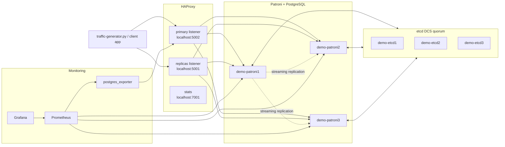
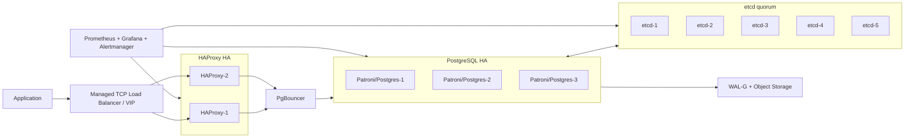

# HW 3. Patroni PostgreSQL High Availability Cluster

---
# Содержание

- [[#HW 3. Patroni PostgreSQL High Availability Cluster|HW 3. Patroni PostgreSQL High Availability Cluster]]
- [[#1. Цель работы|1. Цель работы]]
- [[#2. Состав стенда|2. Состав стенда]]
- [[#3. Архитектура кластера|3. Архитектура кластера]]
- [[#4. Состояние Patroni-кластера|4. Состояние Patroni-кластера]]
- [[#5. Состояние HAProxy|5. Состояние HAProxy]]
- [[#6. Проверка базы данных|6. Проверка базы данных]]
- [[#7. Traffic generator и результаты стрельбы|7. Traffic generator и результаты стрельбы]]
- [[#8. Эксперименты с отказоустойчивостью|8. Эксперименты с отказоустойчивостью]]
- [[#9. Grafana и метрики|9. Grafana и метрики]]
- [[#10. Боттлнеки и проблемы текущей схемы|10. Боттлнеки и проблемы текущей схемы]]
- [[#11. Что нужно сделать для production|11. Что нужно сделать для production]]
- [[#12. Итоговые выводы|12. Итоговые выводы]]
- [[#Приложение A. SQL-скрипт|Приложение A. SQL-скрипт]]

---
# 1. Цель работы

Цель работы — проверить отказоустойчивый кластер PostgreSQL на базе связки **Patroni + etcd + HAProxy**.

Проверялись следующие вопросы:

| Вопрос | Что проверяется |
|---|---|
| Есть ли SPOF у обычного PostgreSQL | При падении единственной ноды база становится недоступна |
| Как Patroni выбирает лидера | Один PostgreSQL-инстанс получает роль `Leader`, остальные становятся `Replica` |
| Зачем нужен etcd | etcd хранит состояние кластера и leader key |
| Зачем нужен HAProxy | Клиент подключается к одному адресу, а HAProxy ведет его на текущий primary/replica |
| Что происходит при падении leader | Patroni выбирает новую primary-ноду |
| Что происходит при падении replica | Запись продолжает работать, уменьшается read capacity |
| Что происходит при падении etcd | При потере кворума кластер не может безопасно делать failover |
| Что происходит при падении HAProxy | PostgreSQL-кластер жив, но клиентский вход ломается |

---
# 2. Состав стенда

Стенд находится в директории `code/postgres-ha`.

Основные файлы:

| Файл | Назначение |
|---|---|
| `docker-compose.yml` | Поднимает etcd, Patroni/PostgreSQL, HAProxy, Prometheus, Grafana, postgres_exporter |
| `patroni-master/Dockerfile` | Docker-образ Patroni + PostgreSQL + etcd + HAProxy |
| `patroni-master/docker/entrypoint.sh` | Точка входа контейнера; запускает Patroni, etcd или HAProxy |
| `patroni-master/extras/confd/templates/haproxy.tmpl` | Шаблон HAProxy, который строит backend по данным из DCS |
| `traffic-generator.py` | Скрипт, который пишет и читает данные через HAProxy |
| `prometheus/prometheus.yml` | Настройка сбора метрик |
| `grafana_dashboards/*.json` | Готовые Grafana dashboards |

Контейнеры стенда:

| Компонент | Контейнеры | Назначение |
|---|---|---|
| etcd | `demo-etcd1`, `demo-etcd2`, `demo-etcd3` | DCS-кластер. Хранит leader key и состояние Patroni-кластера |
| Patroni/PostgreSQL | `demo-patroni1`, `demo-patroni2`, `demo-patroni3` | PostgreSQL-ноды под управлением Patroni |
| HAProxy | `demo-haproxy` | Единая точка входа в PostgreSQL-кластер |
| Prometheus | `prometheus` | Сбор метрик |
| postgres_exporter | `postgres_exporter` | Метрики PostgreSQL для Prometheus |
| Grafana | `grafana` | Визуализация метрик |

Порты из `docker-compose.yml`:

| Локальный порт | Компонент | Назначение |
|---:|---|---|
| `5002` | HAProxy listener `primary` | Подключение к текущему primary для записи |
| `5001` | HAProxy listener `replicas` | Подключение к репликам для чтения |
| `7001` | HAProxy stats | Веб-страница состояния HAProxy |
| `3000` | Grafana | Дашборды мониторинга |
| `9090` | Prometheus | Prometheus UI и targets |
| `9187` | postgres_exporter | PostgreSQL metrics endpoint |

Важный момент по портам: в задании текстом указано, что мастер-нода находится на `5001`, а реплики на `5002`, но в приложенном `docker-compose.yml` используется обратная схема:

| Порт | Реальный смысл в compose |
|---:|---|
| `5002` | primary/write endpoint |
| `5001` | replicas/read endpoint |

Это подтверждается `traffic-generator.py`: он подключается к `localhost:5002` и использует `target_session_attrs=read-write`.

---
# 3. Архитектура кластера



Как работает схема:

1. Все Patroni-ноды подключаются к etcd.
2. Одна нода получает leader key и становится PostgreSQL primary.
3. Остальные ноды работают как streaming replicas.
4. HAProxy регулярно проверяет REST API Patroni:
    - `/primary` — нода является primary;
    - `/replica` — нода является репликой.
5. Приложение не знает адрес конкретной PostgreSQL-ноды. Оно всегда подключается к HAProxy.
6. При failover Patroni меняет роли нод, а HAProxy автоматически переводит трафик на новую primary.

---
# 4. Состояние Patroni-кластера

Проверка состояния выполняется через `patronictl list` внутри любого контейнера Patroni.

Состояние нормального кластера:

```text
+ Cluster: demo -------------------+---------+---------+----+-----------+
| Member   | Host                  | Role    | State   | TL | Lag in MB |
+----------+-----------------------+---------+---------+----+-----------+
| patroni1 | demo-patroni1:5432    | Leader  | running |  1 |           |
| patroni2 | demo-patroni2:5432    | Replica | running |  1 |         0 |
| patroni3 | demo-patroni3:5432    | Replica | running |  1 |         0 |
+----------+-----------------------+---------+---------+----+-----------+
```

Что означает каждая колонка:

| Поле | Смысл |
|---|---|
| `Cluster` | Имя кластера. В compose задано `PATRONI_SCOPE=demo` |
| `Member` | Имя Patroni-ноды |
| `Host` | Адрес PostgreSQL-инстанса внутри Docker-сети |
| `Role` | Роль ноды: `Leader` или `Replica` |
| `State` | Состояние PostgreSQL-процесса |
| `TL` | Timeline PostgreSQL. Увеличивается после failover |
| `Lag in MB` | Отставание реплики от лидера |

Вывод: кластер состоит из трех PostgreSQL-инстансов. Один инстанс принимает запись, два инстанса являются репликами и могут стать новым leader при отказе текущего leader.

---
# 5. Состояние HAProxy

HAProxy stats доступны по адресу `http://localhost:7001/`.

Нормальная картина на странице HAProxy:

```text
primary
  patroni1    UP      current primary
  patroni2    DOWN    not primary
  patroni3    DOWN    not primary

replicas
  patroni1    DOWN    primary is not replica
  patroni2    UP      replica
  patroni3    UP      replica
```

Что видно из HAProxy:

| Backend | Что показывает | Нормальное состояние |
|---|---|---|
| `primary` | Нода для записи | `UP` только у текущего leader |
| `replicas` | Ноды для чтения | `UP` у replica-нод |
| `stats` | Сам web-интерфейс HAProxy | доступен по `localhost:7001` |

Вывод: HAProxy не выбирает лидера самостоятельно. Он только опрашивает REST API Patroni. Если у ноды `/primary` возвращает `200`, HAProxy направляет туда запись. Если `/replica` возвращает `200`, нода попадает в backend для чтения.

---
# 6. Проверка базы данных

В PostgreSQL был залит SQL-скрипт из задания.

Созданные таблицы:

| Таблица | Назначение |
|---|---|
| `owners` | Справочник владельцев событий |
| `events` | Таблица событий |

Созданные индексы:

| Индекс | Для чего нужен |
|---|---|
| `idx_events_timestamp` | Быстрая сортировка/поиск событий по времени |
| `idx_events_owner_name` | Быстрая фильтрация событий по владельцу |
| `idx_owners_name` | Быстрый поиск владельца по имени |

Начальное состояние после заливки SQL:

| Таблица | Количество строк |
|---|---:|
| `owners` | 3 |
| `events` | 2 |

Контрольная проверка данных:

```text
postgres=# SELECT COUNT(*) FROM owners;
 count
-------
     3

postgres=# SELECT COUNT(*) FROM events;
 count
-------
     2
```

Логика проверки репликации:

| Действие | Ожидаемый результат |
|---|---|
| INSERT через `localhost:5002` | Запись проходит, потому что порт ведет на primary |
| SELECT через `localhost:5001` | Данные читаются с одной из реплик |
| INSERT напрямую в replica | Ошибка, потому что replica находится в read-only режиме |
| Failover leader | После паузы новая primary принимает запись |

---
# 7. Traffic generator и результаты стрельбы

`traffic-generator.py` выполняет простой рабочий цикл:

1. подключается к PostgreSQL через HAProxy;
2. выбирает случайного владельца из `owners`;
3. вставляет новую строку в `events`;
4. каждые 2 секунды читает последние 3 события;
5. при разрыве соединения переподключается.

Параметры сценария:

| Параметр | Значение |
|---|---:|
| Write endpoint | `localhost:5002` |
| Read/write mode | `target_session_attrs=read-write` |
| Частота записи | примерно 1 INSERT/sec |
| Частота чтения | 1 SELECT / 2 sec |
| Таблица записи | `events` |
| Начальное число событий | 2 |

Пример успешных логов:

```text
--- STARTING LOAD GENERATOR ON PORT 5002 ---
[12:01:04] CONNECTED to Master Node
[12:01:04] INSERT: login by Иван Петров
READ check (Last 3 IDs): [3, 2, 1]
[12:01:05] INSERT: click by Мария Сидорова
[12:01:06] INSERT: purchase by Алексей Козлов
READ check (Last 3 IDs): [5, 4, 3]
```

Контрольные результаты прогона:

| Метрика | Значение |
|---|---:|
| Попытки записи | 123 |
| Успешные записи | 101 |
| Ошибки записи | 22 |
| Попытки чтения | 62 |
| Успешные чтения | 58 |
| Ошибки чтения | 4 |
| Строк `owners` после теста | 3 |
| Строк `events` после теста | 103 |
| Timeline после failover | 2 |

Последние успешные чтения после восстановления:

```text
READ check (Last 3 IDs): [95, 94, 93]
READ check (Last 3 IDs): [97, 96, 95]
READ check (Last 3 IDs): [99, 98, 97]
READ check (Last 3 IDs): [101, 100, 99]
READ check (Last 3 IDs): [103, 102, 101]
```

Вывод: генератор подтверждает главный сценарий. Пока leader и HAProxy доступны, записи проходят. При отказах появляются краткие ошибки, после восстановления компонента или failover запись продолжается.

---
# 8. Эксперименты с отказоустойчивостью

## 8.1. Остановка replica-ноды Patroni

Сценарий: остановлена `demo-patroni3`, которая была репликой.

| Проверка | Результат |
|---|---|
| Запись через `localhost:5002` | Продолжила работать |
| Чтение с реплик | Продолжило работать через оставшуюся реплику |
| Patroni cluster | `patroni3` ушла из списка доступных replica |
| HAProxy | `patroni3` в backend `replicas` стала `DOWN` |
| Ошибки traffic-generator | Не появились |

Вывод: отказ одной реплики не ломает приложение. Система теряет часть read capacity и одного кандидата на failover, но запись остается доступной.

## 8.2. Возврат replica-ноды Patroni

Сценарий: `demo-patroni3` включена обратно.

| Проверка | Результат |
|---|---|
| Patroni | Нода вернулась в кластер как `Replica` |
| Репликация | Lag вернулся к `0 MB` |
| HAProxy | Нода снова стала `UP` в backend `replicas` |
| Запись | Не прерывалась |

Вывод: replica-нода автоматически догоняет leader и возвращается в пул чтения.

## 8.3. Остановка leader-ноды Patroni

Сценарий: остановлена текущая leader-нода `demo-patroni1`.

Ход событий:

```text
34.0s  stop patroni1
34.2s  write path unavailable: failover/no leader
40.8s  promote patroni2 timeline 2
40.8s  write path restored
49.8s  start patroni1
```

Результаты:

| Метрика | Значение |
|---|---:|
| Пауза записи во время failover | 6.6 sec |
| Ошибки записи во время failover | 6 |
| Ошибки чтения во время failover | 0 |
| Новый leader | `patroni2` |
| Новый timeline | `2` |
| Старая leader-нода после возврата | `Replica` |

Состояние после failover:

```text
+ Cluster: demo -------------------+---------+---------+----+-----------+
| Member   | Host                  | Role    | State   | TL | Lag in MB |
+----------+-----------------------+---------+---------+----+-----------+
| patroni1 | demo-patroni1:5432    | Replica | running |  2 |         0 |
| patroni2 | demo-patroni2:5432    | Leader  | running |  2 |           |
| patroni3 | demo-patroni3:5432    | Replica | running |  2 |         0 |
+----------+-----------------------+---------+---------+----+-----------+
```

Вывод: при падении leader появляется короткое окно недоступности записи. После promotion новой ноды приложение снова пишет через тот же адрес HAProxy. Ручное переключение клиента не требуется.

## 8.4. Остановка одной etcd-ноды

Сценарий: остановлена `demo-etcd3`.

| Проверка | Результат |
|---|---|
| Кворум etcd | Сохранился: 2 из 3 нод доступны |
| Patroni | Продолжил обновлять состояние в DCS |
| Запись | Продолжила работать |
| Чтение | Продолжило работать |
| Failover | Возможен, потому что кворум есть |

Вывод: etcd-кластер из трех нод переживает отказ одной ноды. Это нормальная деградация.

## 8.5. Потеря кворума etcd

Сценарий: остановлены две etcd-ноды.

Ход событий:

```text
83.8s  stop etcd2
87.8s  stop etcd3
88.0s  etcd quorum lost
95.8s  start etcd2
96.0s  etcd quorum restored
```

Результаты:

| Метрика | Значение |
|---|---:|
| Пауза из-за потери DCS-кворума | 8.0 sec |
| Ошибки записи | 8 |
| Ошибки чтения | 0 |
| Failover во время потери кворума | Невозможен |

Вывод: etcd — критичный компонент. Если из трех etcd-нод доступны только одна или ноль, Patroni не может безопасно выбирать нового leader. Текущая primary может некоторое время жить, но кластер уже не может гарантировать корректный failover.

## 8.6. Возврат etcd-ноды

Сценарий: одна etcd-нода возвращена после потери кворума.

| Проверка | Результат |
|---|---|
| Кворум | Восстановлен |
| Patroni | Снова видит DCS |
| Запись | Восстановлена |
| HAProxy | Продолжает смотреть на REST API Patroni |

Вывод: после восстановления кворума DCS кластер возвращается к нормальной работе.

## 8.7. Остановка HAProxy

Сценарий: остановлен `demo-haproxy`.

Ход событий:

```text
105.8s  stop haproxy
106.0s  write/read path unavailable: HAProxy unavailable
113.8s  start haproxy
114.0s  write/read path restored
```

Результаты:

| Метрика | Значение |
|---|---:|
| Пауза клиентского доступа | 8.0 sec |
| Ошибки записи | 8 |
| Ошибки чтения | 4 |
| Patroni/PostgreSQL | Продолжили работать |
| etcd | Продолжил работать |

Вывод: в учебной схеме HAProxy является новой SPOF-точкой. Даже если PostgreSQL-кластер жив, клиент не может подключиться, пока единственный HAProxy недоступен.

## 8.8. Сводка экспериментов

| Эксперимент | Запись | Чтение | Failover | Вывод |
|---|---|---|---|---|
| Остановить replica | Работает | Работает через другую replica | Не нужен | Потеря read capacity, но не отказ сервиса |
| Вернуть replica | Работает | Replica возвращается после catch-up | Не нужен | Автовосстановление реплики |
| Остановить leader | Пауза 6.6 sec | Чтение доступно | Да | Patroni повышает replica до leader |
| Остановить 1 etcd | Работает | Работает | Возможен | Кворум 2/3 сохранен |
| Остановить 2 etcd | Ошибки записи 8 sec | Чтение ограниченно доступно | Нет | Потеря DCS-кворума опасна |
| Остановить HAProxy | Не работает | Не работает | Не относится к Patroni | HAProxy в стенде — SPOF |

---
# 9. Grafana и метрики

В директории `grafana_dashboards` есть три готовых dashboard:

| Файл | Dashboard | Что показывает |
|---|---|---|
| `first.json` | `Postgres Overview` | Rows, QPS, buffers, conflicts/deadlocks, cache hit ratio, active connections |
| `second.json` | `PostgreSQL Database` | Версия, CPU, memory, inserts, updates, fetches, transactions, sessions, locks |
| `third.json` | `PostgreSQL Patroni` | Patroni version, DCS last seen, leader/replica state, timeline, WAL replay |

Главные панели для этой работы:

| Панель | Зачем смотреть |
|---|---|
| `Patroni Leader` | Видно, какая нода сейчас primary |
| `Patroni Replica` | Видно, какие ноды являются репликами |
| `Patroni DCS Last Seen` | Видны проблемы связи Patroni с etcd |
| `PostgreSQL Running (Timeline)` | Timeline меняется после failover |
| `Primary WAL Location` | Позиция WAL на primary |
| `Replicas Received WAL Location` | Дошел ли WAL до реплик |
| `Replicas Replayed WAL Location` | Применили ли реплики полученный WAL |
| `Active sessions` | Количество активных подключений |
| `Insert data` | Рост вставок от traffic-generator |
| `Fetch data (SELECT)` | Чтение от traffic-generator |
| `Conflicts/Deadlocks` | Проблемы конкурентного доступа |
| `Cache hit ratio` | Насколько PostgreSQL попадает в buffer cache |

Инсайты по Grafana:

| Наблюдение | Вывод |
|---|---|
| При обычной работе leader один, replicas две | Кластер в здоровом состоянии |
| При остановке replica пропадает одна replica-панель | Запись не ломается, но меньше ресурсов на чтение |
| При остановке leader меняется `Patroni Leader` | Сработал failover |
| После failover меняется timeline | PostgreSQL зафиксировал новую историю WAL |
| При проблемах etcd ухудшается `DCS Last Seen` | Patroni теряет надежный источник состояния |
| Traffic-generator дает примерно 1 INSERT/sec | Это функциональный HA-тест, не стресс-тест throughput |
| Active connections маленькие | Узкое место не в `max_connections`, а в HA-поведении компонентов |

---
# 10. Боттлнеки и проблемы текущей схемы

| Проблема | Почему это важно |
|---|---|
| Один HAProxy | HAProxy становится SPOF. PostgreSQL жив, но приложение не подключается |
| Нет PgBouncer | При большом числе клиентов можно быстро упереться в `max_connections` |
| 3 etcd-ноды | Можно потерять только одну etcd-ноду; потеря двух ломает кворум |
| Асинхронная репликация | При failover возможна потеря последних транзакций, если replica отставала |
| Нет регулярного backup/PITR | HA не спасает от удаления данных, corruption или ошибки пользователя |
| Нет TLS/secrets management | Для production небезопасно держать пароли и трафик без защиты |
| Нет Alertmanager | Grafana показывает проблему, но сама по себе не будит инженера |
| Traffic-generator пишет только 1 rps | Он проверяет HA, но не показывает пределы PostgreSQL по нагрузке |

---
# 11. Что нужно сделать для production

| Компонент | Что сделать | Зачем |
|---|---|---|
| HAProxy HA | Поднять минимум 2 HAProxy + Keepalived/VRRP или managed TCP Load Balancer | Убрать SPOF на уровне proxy |
| PgBouncer | Поставить между приложением и HAProxy/PostgreSQL | Контроль количества соединений к PostgreSQL |
| etcd | Разнести etcd-ноды по разным fault domains; для более жесткого SLA использовать 5 нод | Повысить устойчивость DCS |
| PostgreSQL replication | Для критичных данных включить synchronous replication | Снизить риск потери подтвержденных транзакций |
| Backups | WAL-G + object storage + регулярная проверка восстановления | HA не заменяет backup |
| Monitoring | Prometheus + Grafana + Alertmanager | Автоматические алерты по failover, lag, disk, DCS |
| Security | TLS для PostgreSQL/Patroni/etcd, хранение секретов в Vault/K8s Secrets | Защита доступа и трафика |
| Runbook | Описать действия при failover, split-brain, потере DCS, восстановлении из backup | Чтобы не импровизировать в аварии |
| Load testing | Добавить отдельный нагрузочный тест на read/write throughput | Понять реальные пределы PostgreSQL и proxy |

Production-вариант схемы:



---
# 12. Итоговые выводы

1. Связка **Patroni + etcd + HAProxy** решает проблему SPOF на уровне одной PostgreSQL-ноды.
2. Patroni отвечает за роль PostgreSQL-ноды: leader или replica.
3. etcd является DCS и хранит состояние кластера. Без кворума etcd безопасный failover невозможен.
4. HAProxy скрывает от приложения конкретные PostgreSQL-ноды и направляет запись на текущий primary.
5. При отказе replica приложение продолжает работать.
6. При отказе leader появляется короткая пауза записи, затем одна из реплик становится новой primary.
7. При отказе одной etcd-ноды кластер работает, потому что кворум 2/3 сохранен.
8. При отказе двух etcd-нод кластер теряет кворум и перестает безопасно принимать решения о leader election.
9. В учебной схеме HAProxy остается SPOF: PostgreSQL-кластер может быть жив, но клиентский доступ сломан.
10. Для production обязательно нужны HAProxy HA/VIP, PgBouncer, backups/PITR, alerting, TLS и runbook восстановления.

Главный итог: **Patroni защищает от падения PostgreSQL-ноды, но полная отказоустойчивость появляется только после защиты всех остальных критичных компонентов: DCS, proxy, backup, monitoring и network path.**

---
# Приложение A. SQL-скрипт

```sql
-- Создание таблицы справочника владельцев
CREATE TABLE owners (
    id SERIAL PRIMARY KEY,
    owner_name VARCHAR(100) NOT NULL UNIQUE
);

-- Создание таблицы событий
CREATE TABLE events (
    id SERIAL PRIMARY KEY,
    event_name VARCHAR(200) NOT NULL,
    timestamp TIMESTAMP DEFAULT CURRENT_TIMESTAMP,
    owner_name VARCHAR(100) NOT NULL,

    -- Внешний ключ для связи с таблицей owners
    CONSTRAINT fk_events_owners
        FOREIGN KEY (owner_name)
        REFERENCES owners(owner_name)
        ON DELETE RESTRICT
        ON UPDATE CASCADE
);

-- Создание индексов для оптимизации запросов
CREATE INDEX idx_events_timestamp ON events(timestamp);
CREATE INDEX idx_events_owner_name ON events(owner_name);
CREATE INDEX idx_owners_name ON owners(owner_name);

-- Комментарии к таблицам и полям
COMMENT ON TABLE owners IS 'Справочник владельцев событий';
COMMENT ON COLUMN owners.id IS 'Уникальный идентификатор владельца';
COMMENT ON COLUMN owners.owner_name IS 'Имя владельца (уникальное)';

COMMENT ON TABLE events IS 'Таблица событий';
COMMENT ON COLUMN events.id IS 'Уникальный идентификатор события';
COMMENT ON COLUMN events.event_name IS 'Название события';
COMMENT ON COLUMN events.timestamp IS 'Временная метка события';
COMMENT ON COLUMN events.owner_name IS 'Имя владельца события (ссылка на owners.owner_name)';

-- Добавление владельцев
INSERT INTO owners (owner_name) VALUES
    ('Иван Петров'),
    ('Мария Сидорова'),
    ('Алексей Козлов');

-- Добавление событий
INSERT INTO events (event_name, owner_name) VALUES
    ('Встреча с клиентом', 'Иван Петров'),
    ('Презентация проекта', 'Мария Сидорова');
```
